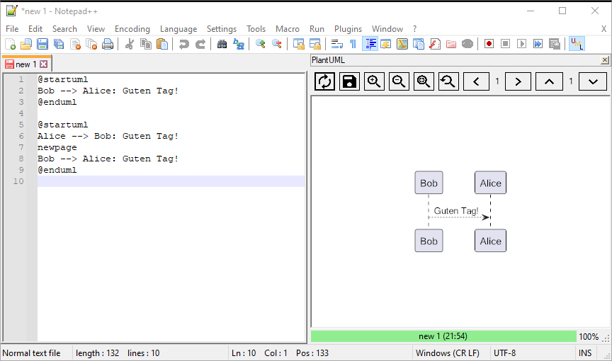
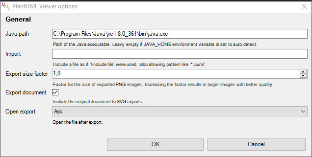

# PlantUML Viewer

A [Notepad++](https://notepad-plus-plus.org/) plugin to generate, view and export [PlantUML](https://plantuml.com/) diagrams.

## Features
* Official and full PlantUML syntax
* Multiple diagrams per document supported
* Dockable panel to show the generated PlantUML diagrams
* Zoomable diagrams
* Export of diagrams as PNG or SVG
* Dark mode support

## Latest changes
You can find latest and all other changes in the [changelog](CHANGELOG.md).

## Installation
Download a [release version](https://github.com/Fruchtzwerg94/PlantUmlViewer/releases) and copy the folder *PantUmlViewer* with its content to the *plugins* subfolder of your Notepad++ installation directory.

### Plugin Manager
If you have the [Plugin Manager](https://github.com/bruderstein/nppPluginManager) installed you can search for *PlantUML Viewer* and install it.

### Compatibility
This plugin requires at least
* Notepad++ 32-bit or 64-bit
* Windows
* .NET Framework 4.6.1 or above
* Java

## Usage
PlantUML Viewer can be opened
* by clicking the toolbar icon 
* via the *Plugins* submenu

By clicking the *Refresh* button the diagram gets generated out of the current opened document. The file extension doesn't matter.
The diagram can be moved by dragging and zoomed by scrolling.
The currently showed diagram can be exported or copied to clipboard as PNG or SVG image by clicking the *Export* button or using the right click context menu.

Make sure *JAVA_PATH* is set in your system or set the right path to your Java installation in the plugins options.

### Usability hints
* You may also want use this plugin in combination with [PlantUML_Notepad-_UDL](https://github.com/brianmaher84/PlantUML_Notepad-_UDL), which enables the PlantUML language syntax for Notepad++.
* Using the *Shortcut Mapper*, which is accessible via the *Settings* submenu of Notepad++, you can define a shortcut to generate the diagrams.

## License and credits
PlantUML Viewer is released under the [MIT License](LICENSE).

This Notepad++ plugin integrates multiple other libraries and sources. Credits and thanks to all the developers working on these great projects:
* The plugin is based on the [Notepad++ PluginPack.net](https://github.com/kbilsted/NotepadPlusPlusPluginPack.Net) by kbilsted provided under the Apache 2.0 license.
* The plugin uses [PlantUml.Net](https://github.com/KevReed/PlantUml.Net) by KevReed provided under the MIT License.
* The plugin uses [SVG.NET](https://github.com/svg-net/SVG) provided under the Microsoft Public License which depends on
    * [Fizzler](https://github.com/atifaziz/Fizzler) by atifaziz provided under the GNU Lesser General Public License.
* The plugin uses the [ImageBox Control](https://github.com/cyotek/Cyotek.Windows.Forms.ImageBox) by Cyotek provided under the MIT License.
* The plugin uses the [LoadingCircle](https://www.codeproject.com/articles/14841/how-to-write-a-loading-circle-animation-in-net) by Martin Gagne provided under the Code Project Open License.
* The plugin uses [Json.NET](https://www.newtonsoft.com/json) by James Newton-King provided under the MIT License.
* The plugin uses [Material Design Icons](https://materialdesignicons.com/) provided under the Pictogrammers Free License.
* The plugin is packed using [ILMerge](https://github.com/dotnet/ILMerge) provided under the MIT License.
* The plugin release includes the binaries of [PlantUML](https://plantuml.com/) which are free to use and released under the GNU General Public License.
* The plugin release includes the binaries of [JLaTeXMath](https://github.com/opencollab/jlatexmath) which are free to use and released under the GNU General Public License and depends on
    * [The Apache™ Batik Project](https://xmlgraphics.apache.org/batik/) which are free to use released under the Apache 2.0 license.

## Feedback, issues and contribution
Resonable feedback, issues and contributions are always very welcome. Feel free to bring in your points!

## Disclaimer
This source and the whole package comes without warranty. It may or may not harm your computer or cell phone. Please use with care. Any damage cannot be related back to the author. The source has been tested on a virtual environment and scanned for viruses and has passed all tests.

## Personal Note
*I've created this software in my leasure time since I found no comparable solution to preview PlantUML diagrams seamlessly in Notepad++. This software (with all its bugs) is not aiming to be an enterprise solution. It surely will not fulfill the needs of everybody. But it maybe is a nice little helper for some of you. I am always open for your reasonable feedback, issues and contributions. Feel free to contact me and have fun with it.*
